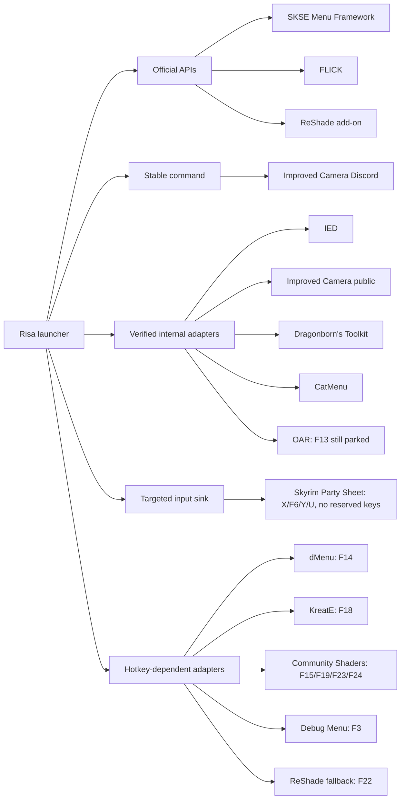

# Integration Status

Last updated: 2026-07-01

This document tracks how each menu is controlled, whether the integration is official, what
can break after an update, and where an author-provided API would remove remaining risk.

## Integration Matrix

| Mod | Current backend | Official API | Hidden key | State query | Update activity | Risk | API action |
|---|---|---:|---:|---:|---|---|---|
| SKSE Menu Framework | Framework window API | Yes | None | Yes | Working | Low | None |
| FLICK | RequestFUCK API | Yes | None | Yes | Working | Low | None |
| ReShade add-on | ReShade add-on API | Yes | None | Yes | Working | Low | None |
| IED 1.7.5b | Native render-task lifecycle | No | None | Yes | Last update 2023-12-10 | Medium | API desirable, low urgency |
| Improved Camera public | Verified internal UIMenu functions | No | None | Yes | Working | Medium | API desirable |
| Improved Camera Discord | Registered `ic menu` command and Escape | Partial | None | Tracked | Working | Medium | Close/query API desirable |
| Dragonborn's Toolkit | Internal `SetMenuOpen(bool)` | No | None | Yes | Unknown | Medium | API desirable |
| CatMenu | Direct UI state and listener interception | No | None | Yes | Older/unsupported | Medium | Monitor only |
| Skyrim Party Sheet | Targeted sink plus guarded native Inspect Card | No | None | Tracked | Last update 2026-06-17 | Medium | Request open/close/query API |
| Open Animation Replacer | Internal UIManager state | No | F13 | Yes | Last update 2026-06-27 | Medium-high | Request API/native-key disable |
| dMenu NG | Relocated listener and key injection | No | F14 | No | Last update 2026-03-16 | High | Author contacted |
| KreatE | Relocated listener and simulated input | No | F18 | No | Last update 2026-02-25 | High | Author contacted |
| Community Shaders | Managed hidden-key actions | No | F15/F19/F23/F24 | Partial | Unknown | High | Highest API priority |
| Debug Menu | Managed key path | No | F3 | Partial | Unknown | Medium-high | Request API |
| ENB Editor | Native chord management | No | Shift+Enter | Tracked | External project | Medium | Keep compatibility path |
| ReShade non-add-on | Relocated fallback key | No | F22 | Tracked | Compatibility fallback | Medium | Prefer add-on build |

## Architecture Map

## API Outreach Queue

| Priority | Mod | Requested capability | Contact status |
|---:|---|---|---|
| 1 | Community Shaders | Open/close/query each menu surface | Not recorded |
| 2 | dMenu NG | Open, close, toggle, and `IsOpen` | Author contacted |
| 3 | KreatE | Open, close, toggle, and `IsOpen` | Author contacted |
| 4 | Open Animation Replacer | Open/close/query plus native-key disable | Not recorded |
| 5 | Debug Menu | Open, close, and `IsOpen` | Not recorded |
| 6 | IED | Add UI methods to `SKMP_GetPluginInterface` v2 | Message prepared |
| 7 | Skyrim Party Sheet | Open/close/query Settings, Party Sheet, Inspect Card, and Character Sheet | Not recorded |

## Risk Meaning

- **Low:** Uses a documented interface owned by the target project.
- **Medium:** Keyless and validated, but relies on a command or private implementation detail.
- **High:** Depends on input simulation, a relocated listener, or incomplete state detection.

## Validated Party Sheet Build

`SkyrimPartySheet.dll` from 2026-06-17, 2,858,496 bytes, SHA-256
`7286E2FB1F30C8335437BECAAC2455AACD7D8648B1E454C1375601748A6CD94F`.
Settings, Party Sheet, and Character Sheet discover the registered SKSE input sink at runtime.
Inspect Card uses an exact-build native adapter because the mod's target lookup fails after launcher interaction.

## Update Checklist

1. Record the target DLL version, timestamp, image size, and hash.
2. Test launcher open, launcher-hotkey close, Escape close, and original-hotkey aliases.
3. Confirm gameplay still receives the freed physical key.
4. Confirm no hidden-key collision opens a second menu.
5. Update both this matrix and `HOTKEY_ALLOCATION.txt`.
